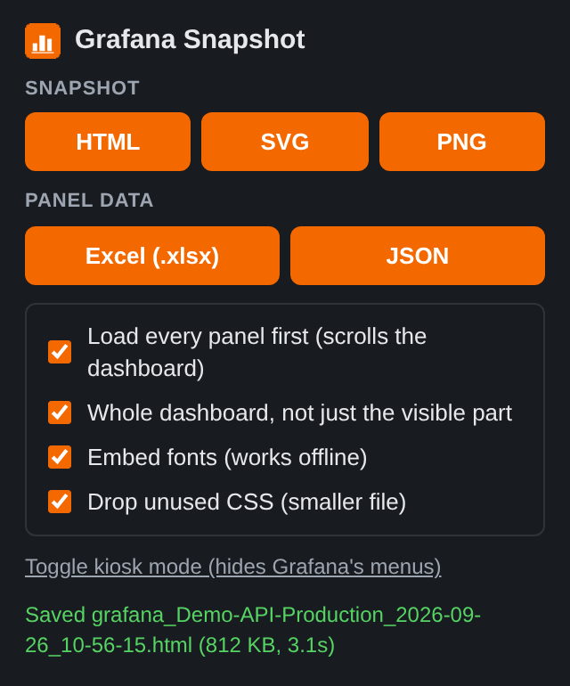

# Grafana Snapshot

[](https://github.com/apolzek/grafana-snapshot/actions/workflows/ci.yml)
[](LICENSE)

A Chrome extension that exports a Grafana dashboard **exactly as you see it**, and the data behind **every panel at once**.

| Export | What you get |
| --- | --- |
| **HTML** | A single self-contained file that opens offline in any browser. Text stays selectable, tables keep their scroll position. |
| **SVG** | The whole page as one vector image (`<foreignObject>`), viewable in any browser. |
| **PNG** | A full-page image at your screen's resolution. |
| **Excel (.xlsx)** | A summary sheet plus one sheet per panel. Time series are joined by timestamp. Dates and numbers are native Excel values. |
| **JSON** | Every panel with its frames and fields (`name`, `type`, `unit`, `labels`, `values`) in one file. |

<p align="center">
  
</p>

## Why

Grafana's built-in export options each cover part of this:

- **CSV** comes from one panel at a time (Inspect, then Data).
- **Image rendering** needs the renderer plugin.
- **Shared snapshots** live on a server.

This extension works from what your browser has already loaded:

- **Complete:** lazy panels below the fold are loaded first, and the whole dashboard is captured, not only the visible part.
- **Faithful:** it keeps your theme, time range, variables and the charts as currently drawn.
- **Private:** nothing leaves your machine. The extension has no servers or analytics. It only re-reads the fonts and images the page already uses, and it never sends your cookies to hosts other than Grafana's.
- **Data as displayed:** panel data is read after transformations, with series named as in the legend and units attached. No queries are re-run.

Tested against Grafana **10.4, 11.6, 12.0 and 13.2**. That covers both classic and Scenes dashboards, and both inner-container and page scrolling.

## Install

**From a release:** download `grafana-snapshot-<version>.zip` from [Releases](https://github.com/apolzek/grafana-snapshot/releases) and unzip it. Then:

1. Open `chrome://extensions`.
2. Enable **Developer mode**.
3. Click **Load unpacked** and select the unzipped folder.

**From source:**

```sh
npm ci
npm run build   # outputs dist/
```

Then load `dist/` as an unpacked extension (same steps as above).

The extension works in Chrome, Edge, Brave and any other Chromium browser, version 110 or later.

## Limitations

- **WebGL canvases** that don't use `preserveDrawingBuffer` (some third-party panels) export blank.
- **Cross-origin canvases** can't be copied, for example Geomap tiles served from another domain. They appear hatched and the popup warns about them.
- **Collapsed rows** are not rendered by Grafana, so their panels are not exported. Expand the rows first.
- **Virtualized tables** only export the rows that were rendered.
- **SVG with `<foreignObject>`** renders in browsers, not in Inkscape or Illustrator. Use the PNG export for image editors.
- **Exports are static:** no tooltips or zooming.

## Development

```sh
npm ci
npm run build          # dist/ (what users install); `npm run watch` to rebuild on change
npm test               # unit tests (node:test)
npm run test:e2e       # end-to-end tests: real extension in Chromium, mock dashboard
npm run package        # grafana-snapshot-<version>.zip
```

The end-to-end suite loads the built extension into Chromium with Playwright, clicks the popup buttons and checks the downloaded files. To also run it against a real Grafana (needs Docker):

```sh
npm run grafana:up                 # Grafana 13.2.2 with a demo dashboard on http://localhost:3000
GRAFANA_URL=http://localhost:3000 npm run test:e2e
npm run grafana:down
```

`node scripts/grafana.mjs up <version> <port>` starts any other Grafana version. CI runs the suite against Grafana 10.4, 11.6, 12.0 and 13.2.

Some tests use extra tools when they are installed: Python checks the ZIP output and LibreOffice opens the generated XLSX. Set `CHROMIUM_PATH` to use a system Chromium instead of Playwright's.

### Releasing

Bump `version` in `package.json`, commit, then tag and push:

```sh
git tag v1.1.0
git push --tags
```

The release workflow tests the code, packages the zip and publishes a GitHub release.

## License

[MIT](LICENSE)
